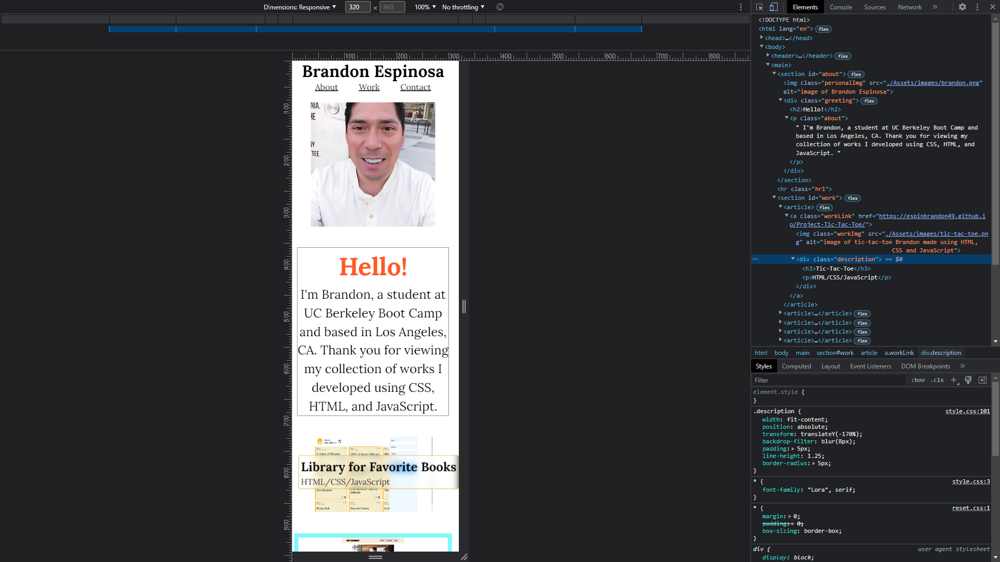
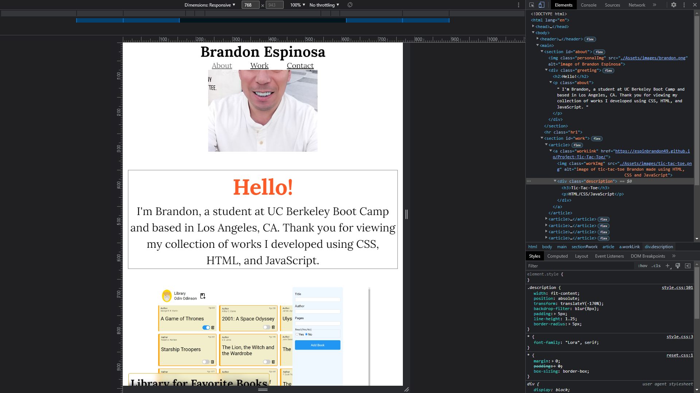
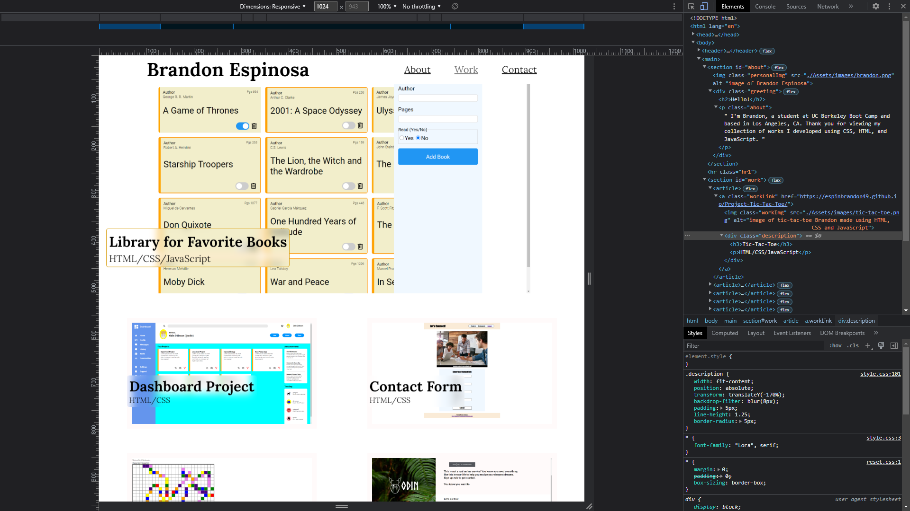
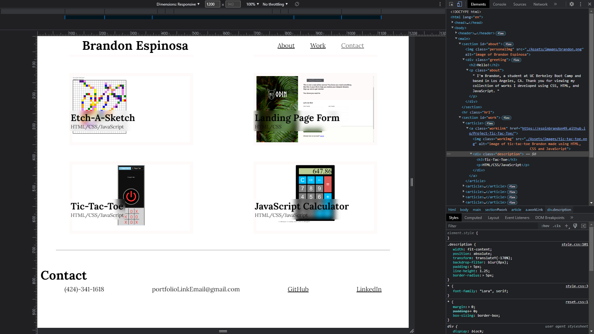

# HTML-CSS-Portfolio

## Description
This website is a collection of web applications with deployed links I developed using HTML, CSS, Git, GitHub, Chrome DevTools in combination so that potential employeee's can view samples of my work to assess my candidacy for an open position.

* When you resize the page or view the site on various screens and devices, then you are presented with a responsive layout that adapts to your viewport.

* My portfolio uses links in  the navigation to scroll to the corresponding section.

* My portfolio includes an about me section to present my name, head shot and how to contact me.

* When you click on the link to the section about my work, you can view titled images of my web applications that are active on "clicking" to be taken to the deployed application.

* My contact section contains 4 different ways to connect with me that I can quickly respond to.

## Installation
### Git clone - https://github.com/espinbrandon49/HTML-CSS-Portfolio

## Tools
### HTML, CSS, Git, GitHub, Chrome DevTools

#### HTML
* The source code uses semantic HTML elements and has a concise, descriptive title.
* The structure of the HTML elements follow a logical structure independent of styling and positioning.
* The image elements have accessible alt attributes.
* The heading attributes fall in sequential order.
* The HTML follows best practices for class/id naming conventions, indentation, quality comments, etc.

#### CSS
* Application user experience is intuitive and easy to navigate.
* Application user interface style is clean and polished.
* Application meets the functionality requirements provided in the Challenge instructions.

#### Git/GitHub
* The Application is deployed at a live URL and loads with no errors.
* Repository follows best practices for file structure and naming conventions.
* Repository contains multiple descriptive commit messages that follow along as the application development story unfolds.
* Repository contains quality readme with description, screenshot, link to deployed application.
* GitHub repository contains application code.

GitHub repository: https://github.com/espinbrandon49/HTML-CSS-Portfolio
Deployed Link: https://espinbrandon49.github.io/HTML-CSS-Portfolio/

#### Chrome DevTools
* My portfolio is a responsive web application, responsive to various screen resolutions, including tablets and mobile.  Using DevTools, I viewed my media queries and application on different device screens.
* Used DevTools to inspect various elements in the Elements panel.
* Used DevTools to examine my box sizes, padding, borders, content, etc., and to view element styles in the browser.

## Collaboration
Jerome Chenette

## Screenshots
### 320px — 480px: Mobile devices
  

### 481px — 768px: iPads, Tablets
  
  
### 769px — 1024px: Small screens, laptops
  

### 1025px — 1200px: Desktops, large screens
  
